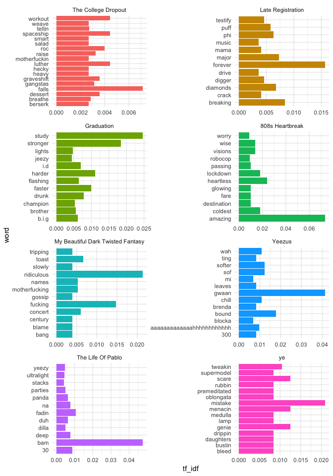
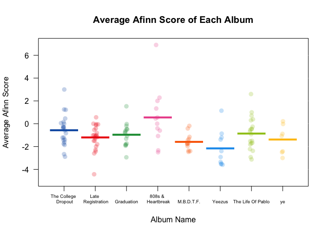
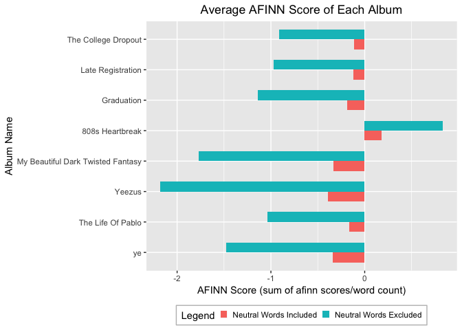
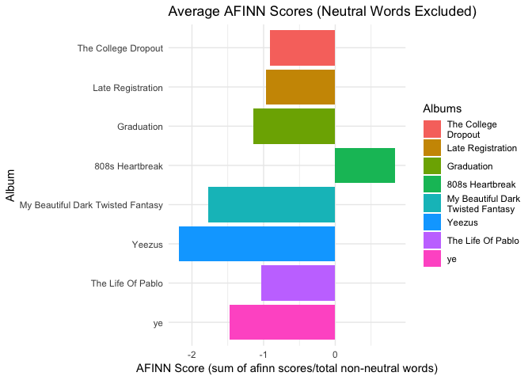
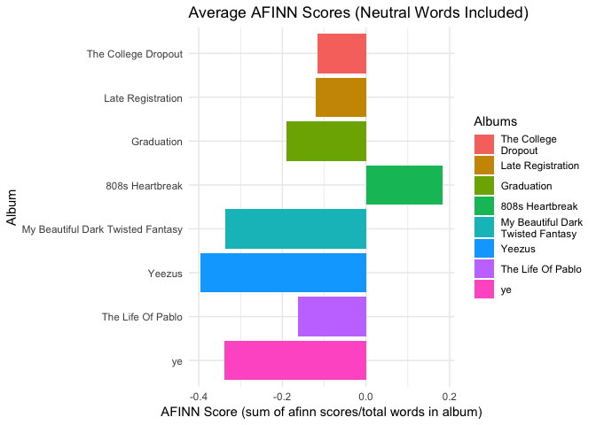
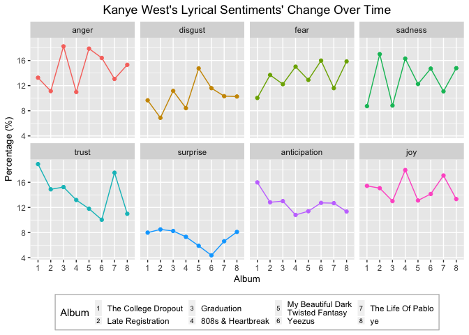

Kanye West Sentiment Analysis
================
Stella Huang
August 2018

### Introduction

Kanye West has been one of the hottest rappers in the game since the early 2000s. Whether it be releasing new singles without notice, dauntlessly stealing the mic during an award show, or blasting his twitter feed with cryptic tweets, his unpredictable behavior is now not unfamiliar to his fans and even the public. Musically, his works can lie on opposite sides of the spectrum; there are songs like “Gold Digger” and “Stronger” that obsess over desired attributes, while songs like “Hey Mama” and “Runaway” reveal his more vulnerable side.

Simultaneously, various libraries in R enable us to perform text mining on any written text. Such libraries have functions that can dissect large chunks of text into singular words and provide more convenient means to alter data via the utilization of tibbles (I like to call it the smarter cousin of dataframes). There are even means to categorize and assign scores to words based on their denotation, which can be powerful in identifying patterns and grasping a general understanding of the text.

### Purpose

The purpose of this project is to lyrically analyze how Kanye West’s albums have changed over time. This project focuses on dissecting the artist’s lyrics by sentiments and examining how such sentiments have individually and holistically altered during the artist’s career; it utilizes text mining and Natural Language Processing techniques.

In this analysis, I primarily used the Genius API to scrapp West’s lyrics and merged in other relevant information. The sentiment analysis was conducted using the sentiments dataset in the tidytext package; I used the afinn and nrc lexicons because they render a numerical and categorical method of measuring a word’s sentiment. The afinn score and nrc sentiment composition for each track and album were calculated then standardized for comparison. In addition, I have examined West’s most commonly used words.

### My Approach

-   Extract lyrics from Genius API
-   Break lyrics into singular words
-   Get each word’s afinn score and nrc sentiment
-   Visualize the change in such ratings over time
-   Examine patterns and numbers for analysis

### Questions Asked

-   What are the most frequently used words and phrases?
-   How has the positivity/negativity rating changed for each album, as well within each album?
-   How does the sentiment of albums compare with neutral words included and excluded?
-   How does the sentiment composition of each album differ from one another?
-   How have specific emotions in his lyrics changed over time?
-   Are Kanye West’s songs musically and lyrically consistent in terms their mood?

### Scraping and Wrangling Lyrics From Kanye's Albums

I applied on Spotify’s and Genius’s API websites for keys (Client ID and Client Code) to obtain access to the information. The code for scraping and wrangling the lyrics can be read [here](https://github.com/stehuang/Kanye-West-Sentiment-Analysis/blob/master/Scrap_and_Tokenize_Lyrics.R)

### What are the most frequently used words and phrases?

To get a general idea of the themes in each albums, I calculated the tf-idf, Term Frequency-Inverse Document Frequency, of each word. The tf-idf consists of two quantities:

-   Term Frequency(tf): how frequently a word occurs in a song
-   Inverse Document Frequency(idf): how important word is to a song in the album

The tf-idf is the frequency of a term adjusted for how rarely it is used. I also removed common words like “there”, “I”, and “ayy” to only examine words with more meaning.

``` r
# compute the tf_idf
tf_lyrics <- refined_lyrics %>% group_by(album_name) %>% count(album_name,word,sort=T) %>% bind_tf_idf(word,album_name,n)
# get word count for each album
total_words <- tf_lyrics %>% group_by(album_name) %>% summarize(total=sum(n))
# combine to tf_idf tibble
tf_lyrics <- left_join(tf_lyrics,total_words)
# plot the tf_idf
tf_lyrics %>% arrange(desc(tf_idf)) %>% 
  mutate(word = factor(word, levels = rev(unique(word)))) %>% group_by(album_name) %>% 
  top_n(12, wt = tf_idf) %>% 
  ggplot(aes(x=word,y=tf_idf, fill=album_name)) + 
  geom_col(aes(fill=album_name), show.legend = F) + 
  facet_wrap(~album_name, ncol = 2, scales = "free") + coord_flip() + theme_minimal()
```



We see that in the first few albums, Kanye used more light-hearted/generic words like “workout”, “forever”, and “study”. For Yeezus and The Life of Pablo, he used more words that mimic sounds, getting more experimental with his lyrics. On his more personal albums, 808s & Heartbreak and ye, Kanye used more words that connote feelings like "worry", "heartless", "premeditated", and "menacing". Also, across each album, there is at least one word that has a noticeably higher tf-idf value, meaning it has been frequently used in a particular song (ex: 'stronger' on the song Stronger and 'amazing' on the song Amazing)

How has the positivity/negativity rating changed for each album, as well within each album?
-------------------------------------------------------------------------------------------

I’ll be using the **afinn lexicon** to measure the positivity/negativity. As defined in the book Text Mining with R,

> “The AFINN lexicon assigns words with a score that runs between -5 and 5, with negative scores indicating negative sentiment and positive scores indicating positive sentiment.”

It provides a numerical measurement of a word’s connotation that the degree of positivity/negativity, hence the best option out of the three. I got the afinn score for each word, then summed up the afinn score for all words and word count in each track. The standardized afinn score for each track was calculated by dividing the total score by the word count. Each dot represents a track and the bar represents the average afinn score of the album.

``` r
# read in csv that contains the afinn score of each lyric
all_songs_afinn <- read.csv("all_songs_afinn.csv")
# reorder albums by chronological order
all_songs_afinn$album_name <- factor(all_songs_afinn$album_name, levels=c("The College Dropout", "Late Registration", "Graduation", "808s Heartbreak", "My Beautiful Dark Twisted Fantasy", "Yeezus", "The Life Of Pablo", "ye"))
all_songs_afinn

# compute afinn score of each track
track_afinn <- all_songs_afinn %>% group_by(track_title) %>% summarize(score=sum(sentiment))

# get word count and average afinn score
temp <- all_songs_afinn %>% group_by(track_title) %>% summarize(total_words = n()) %>% mutate (score=track_afinn$score) %>% mutate(track_afinn=score/total_words)

# get album name and merge
a <- aggregate(all_songs_afinn$sentiment, list(album_name=all_songs_afinn$album_name, track_title=all_songs_afinn$track_title),sum)
avg_track_afinn <- cbind(album_name=a$album_name, temp)
```

``` r
pirateplot(formula=track_afinn~album_name,
           data= avg_track_afinn, xlab="Album Name", ylab="Average Afinn Score",
           main="Average Afinn Score of Each Album",point.o=0.25, avg.line.o=1, theme=0,
           point.pch=16, point.cex = 1.3, cex.names = .6)
```

 **From the pirate plot, we see that:**

-   The artist’s average discography afinn score is negative (around -1)
-   “808s & Heartbreak” is the only positive album; it has more negative tracks, but the one with a score above 6 brought up the album’s mean afinn score
-   Distribution of tracks around their respective albums’ average (below/above the mean) look relatively normal for all 8 albums. Most tracks have afinn scores not too far from the mean
-   Starting from “808s & Heartbreak”, there is a greater change in the average afinn scores for albums
-   “Amazing” on 808s & Heartbreak is the most positive song. This is because Kanye repeats the word “amazing” throughout the song
-   “My Beautiful Dark Twisted Fantasy” has the smallest range of scores; an explanation could be that most tracks are thematically similar, as they touched upon topics such as power, fame, and fortune
-   All albums apart from “My Beautiful Dark Twisted Fantasy” and “ye” seems to have at least a song that is much more positive/negative than the majority; something to note is that the songs on ye are thematically similar too

### Afinn Score With and Without Neutral Words

Accounting for non-neutral words (common words & those with an afinn score of 0) isn’t an effective means to discern the positivity/negativity of an album, as 20 negative words may just account for a small percentage in one song and more in another. I computed the afinn score with neutral words included in the albums, calculated similarly to that of individual songs, to examine this:

``` r
# combine the two differently computed afinn scores
multi_sentiment <- sentiment_average_total %>% mutate(filtered_average = sentiment_average$album_average)
# merge by album name
multi_sentiment <- melt(multi_sentiment, id.vars='album_name')
# plot the average afinn scores for where the neutral words are included and excluded
multi_sentiment %>% ggplot(aes(x=album_name, y=value,fill=variable)) + geom_bar(stat='identity', position='dodge', width=0.65) + coord_flip() + scale_x_discrete(limits=rev(sentiment_average$album_name)) + labs(title="Average AFINN Score of Each Album", x = "Album Name", y="AFINN Score (sum of afinn scores/word count)") + scale_fill_discrete(name="Legend", labels=c("Neutral Words Included", "Neutral Words Excluded")) + theme(legend.position="bottom", legend.background = element_rect(colour = 'grey'),legend.key.size = unit(0.3, "cm"), plot.title = element_text(hjust=0.5))
```



We see that there is a greater word count to non-neutral word ratio, which is expected. Let’s examine the separate graphs:



Even including other words, the general distribution of the mean afinn score plot looks similar. This implies that the afinn score for all albums relatively to each other are not too affected. It is worthy to point out that the afinn scores of each album with neutral words did not all proportionally change; for instance, there is a greater difference in scores between the “The Life of Pablo” and “ye” when we included neutral words.

### How does the sentiment composition of each album differ from one another?

In this section, I will use the nrc lexicon to breakdown the distribution of emotions in Kanye’s albums. As described by Text Mining with R, &gt; “The nrc lexicon categorizes words in a binary fashion (“yes”/“no”) into categories of positive, negative, anger, anticipation, disgust, fear, joy, sadness, surprise, and trust.”

I eliminated the positive and negative categories to opt for more specific emotions. One thing to note is that a word could be categorized as *multiple sentiments*. Here is an example of how words are categorized:

``` r
# making a table that displays the top 5 words for each sentiment
sample_words %>% kable("html",caption = "Top 5 Words for Each Sentiment", align="c", escape=F) %>% kable_styling(c("striped", "bordered"), font_size=12, position="center",full_width = FALSE) %>% row_spec(0, bold = T, background = "#FEF3ED", font_size = 13)
```

<table class="table table-striped table-bordered" style="font-size: 12px; width: auto !important; margin-left: auto; margin-right: auto;">
<caption style="font-size: initial !important;">
Top 5 Words for Each Sentiment
</caption>
<thead>
<tr>
<th style="text-align:center;font-weight: bold;background-color: #FEF3ED;font-size: 13px;">
anger
</th>
<th style="text-align:center;font-weight: bold;background-color: #FEF3ED;font-size: 13px;">
disgust
</th>
<th style="text-align:center;font-weight: bold;background-color: #FEF3ED;font-size: 13px;">
fear
</th>
<th style="text-align:center;font-weight: bold;background-color: #FEF3ED;font-size: 13px;">
sadness
</th>
<th style="text-align:center;font-weight: bold;background-color: #FEF3ED;font-size: 13px;">
trust
</th>
<th style="text-align:center;font-weight: bold;background-color: #FEF3ED;font-size: 13px;">
surprise
</th>
<th style="text-align:center;font-weight: bold;background-color: #FEF3ED;font-size: 13px;">
anticipation
</th>
<th style="text-align:center;font-weight: bold;background-color: #FEF3ED;font-size: 13px;">
joy
</th>
</tr>
</thead>
<tbody>
<tr>
<td style="text-align:center;">
shit
</td>
<td style="text-align:center;">
shit
</td>
<td style="text-align:center;">
god
</td>
<td style="text-align:center;">
black
</td>
<td style="text-align:center;">
god
</td>
<td style="text-align:center;">
money
</td>
<td style="text-align:center;">
time
</td>
<td style="text-align:center;">
love
</td>
</tr>
<tr>
<td style="text-align:center;">
money
</td>
<td style="text-align:center;">
bitch
</td>
<td style="text-align:center;">
broke
</td>
<td style="text-align:center;">
broke
</td>
<td style="text-align:center;">
money
</td>
<td style="text-align:center;">
leave
</td>
<td style="text-align:center;">
god
</td>
<td style="text-align:center;">
baby
</td>
</tr>
<tr>
<td style="text-align:center;">
bitch
</td>
<td style="text-align:center;">
bad
</td>
<td style="text-align:center;">
bitch
</td>
<td style="text-align:center;">
bitch
</td>
<td style="text-align:center;">
real
</td>
<td style="text-align:center;">
guess
</td>
<td style="text-align:center;">
money
</td>
<td style="text-align:center;">
god
</td>
</tr>
<tr>
<td style="text-align:center;">
bad
</td>
<td style="text-align:center;">
damn
</td>
<td style="text-align:center;">
bad
</td>
<td style="text-align:center;">
bad
</td>
<td style="text-align:center;">
brother
</td>
<td style="text-align:center;">
lose
</td>
<td style="text-align:center;">
wait
</td>
<td style="text-align:center;">
money
</td>
</tr>
<tr>
<td style="text-align:center;">
damn
</td>
<td style="text-align:center;">
hate
</td>
<td style="text-align:center;">
hate
</td>
<td style="text-align:center;">
leave
</td>
<td style="text-align:center;">
school
</td>
<td style="text-align:center;">
wild
</td>
<td style="text-align:center;">
start
</td>
<td style="text-align:center;">
music
</td>
</tr>
</tbody>
</table>
##### Now let’s look at the breakdown of sentiments for each album, visualized by a radar-chart. I placed more positive sentiments on the left half and more negative ones on the right half.

``` r
# creating the sentiment radar-chart
chartJSRadar(sentiment_radar,showToolTipLabel=TRUE, main="Sentiment Distribution of Each Album", labelSize = 14, scaleStartValue = 3, maxScale=20, scaleStepWidth = 2,height=400, width=600)
```

<!--html_preserve-->
<canvas id="htmlwidget-e307fc57eed313ff3908" class="chartJSRadar html-widget" width="600" height="400">
</canvas>
<script type="application/json" data-for="htmlwidget-e307fc57eed313ff3908">{"x":{"data":{"labels":["anger","disgust","fear","sadness","trust","anticipation","surprise","joy"],"datasets":[{"label":"The College Dropout","data":[13.26,9.67,10.04,8.74,18.9,15.99,7.99,15.43],"backgroundColor":"rgba(255,0,0,0.2)","borderColor":"rgba(255,0,0,0.8)","pointBackgroundColor":"rgba(255,0,0,0.8)","pointBorderColor":"#fff","pointHoverBackgroundColor":"#fff","pointHoverBorderColor":"rgba(255,0,0,0.8)"},{"label":"Late Registration","data":[11.13,6.88,13.7,17.01,14.88,12.82,8.51,15.07],"backgroundColor":"rgba(0,255,0,0.2)","borderColor":"rgba(0,255,0,0.8)","pointBackgroundColor":"rgba(0,255,0,0.8)","pointBorderColor":"#fff","pointHoverBackgroundColor":"#fff","pointHoverBorderColor":"rgba(0,255,0,0.8)"},{"label":"Graduation","data":[18.25,11.17,12.23,8.83,15.24,13.01,8.25,13.01],"backgroundColor":"rgba(0,0,255,0.2)","borderColor":"rgba(0,0,255,0.8)","pointBackgroundColor":"rgba(0,0,255,0.8)","pointBorderColor":"#fff","pointHoverBackgroundColor":"#fff","pointHoverBorderColor":"rgba(0,0,255,0.8)"},{"label":"808s Heartbreak","data":[10.99,8.42,15.02,16.3,13.19,10.81,7.33,17.95],"backgroundColor":"rgba(255,255,0,0.2)","borderColor":"rgba(255,255,0,0.8)","pointBackgroundColor":"rgba(255,255,0,0.8)","pointBorderColor":"#fff","pointHoverBackgroundColor":"#fff","pointHoverBorderColor":"rgba(255,255,0,0.8)"},{"label":"My Beautiful Dark Twisted Fantasy","data":[17.89,14.74,12.91,12.25,11.8,11.4,5.9,13.11],"backgroundColor":"rgba(255,0,255,0.2)","borderColor":"rgba(255,0,255,0.8)","pointBackgroundColor":"rgba(255,0,255,0.8)","pointBorderColor":"#fff","pointHoverBackgroundColor":"#fff","pointHoverBorderColor":"rgba(255,0,255,0.8)"},{"label":"Yeezus","data":[16.41,11.6,15.98,14.71,10.04,12.73,4.38,14.14],"backgroundColor":"rgba(0,255,255,0.2)","borderColor":"rgba(0,255,255,0.8)","pointBackgroundColor":"rgba(0,255,255,0.8)","pointBorderColor":"#fff","pointHoverBackgroundColor":"#fff","pointHoverBorderColor":"rgba(0,255,255,0.8)"},{"label":"The Life Of Pablo","data":[13.07,10.33,11.6,11.09,17.53,12.68,6.63,17.08],"backgroundColor":"rgba(255,165,0,0.2)","borderColor":"rgba(255,165,0,0.8)","pointBackgroundColor":"rgba(255,165,0,0.8)","pointBorderColor":"#fff","pointHoverBackgroundColor":"#fff","pointHoverBorderColor":"rgba(255,165,0,0.8)"},{"label":"ye","data":[15.32,10.27,15.86,14.77,10.99,11.35,8.11,13.33],"backgroundColor":"rgba(160,32,240,0.2)","borderColor":"rgba(160,32,240,0.8)","pointBackgroundColor":"rgba(160,32,240,0.8)","pointBorderColor":"#fff","pointHoverBackgroundColor":"#fff","pointHoverBorderColor":"rgba(160,32,240,0.8)"}]},"options":{"responsive":true,"title":{"display":true,"text":"Sentiment Distribution of Each Album"},"scale":{"ticks":{"max":20,"min":3,"stepSize":2,"maxTicksLimit":1000},"pointLabels":{"fontSize":14}},"tooltips":{"enabled":true,"mode":"label"},"legend":{"display":true}}},"evals":[],"jsHooks":[]}</script>
<!--/html_preserve-->
**Here are some observations:**

-   On average, surprise has been the weakest sentiment in Kanye’s lyrics
-   Disgust comes in second. However, MBDTF has a higher composition of disgust, which possibly relates to the themes the artists touched upon (fame/fortune/power)
-   For each sentiment, we don’t see an apparent pattern related to the albums’ release order. If the percentages were ordered from least to greatest or vice versa for each sentiment, they would not be in the albums’ chronological order
-   None of the shapes of each album-sentiment breakdown are symmetrical and most have at least one vertex that stands out; this means that some sentiments are indeed much more emphasized in the lyrics

To better examine the change over time, I have plotted the change in individual sentiments over time:



**Some observations include:**

-   Large variations in the change; for instance, the presence of sadness in his lyrics has fluctuated for every album, but the difference in percentages between albums has decreased over time
-   There is a visible decrease of anticipation, although the range is around 5%
-   Relating back to the afinn scores, the most positive album “808s & Heartbreak” has the highest lyrical percentage of joy. This may tell indicate that part of the positivity sources from lyrics connoting happiness
-   The least positive album “Yeezus” has high percentages in anger and fear. The negativity may partially come from lyrics connoting anger and fear
-   Surprise is the least common lyrical sentiment. The difference between its max and min is only 4%
-   If we were to examine the general shape of the line, trust and anticipation have decreased overtime, and fear and sadness have increased overtime

Conclusion
----------

Here is a summary of my key findings:

-   The majority of Kanye's most commonly used words are either generic (i.e. regular nouns) or thematically important to the song it appears in
-   Most albums (7/8) contain more negative sentiments, meaning that most songs contain more negative than positive words
-   My Beautiful Dark Twisted Fantasy is the most thematically cohesive album because its songs have the smallest range of afinn scores
-   On 6 of the 8 albums, there is at least one songs who's lyrics reflect a mood that is much more positive/negative the other songs'
-   The difference in afinn scores for each albums are similar for when neutral words are included/excluded. This may mean that Kanye has retained a similar ratio of neutral words to non-neutral words, and that results from the boxplot (or known as pirate plot) hold
-   No album exemplifies an equal distribution of emotions in its lyrics. There is at least one sentiment that stands out more than the others
-   Out of the 8 sentiments, anger and joy on average are the most dominant in the artist's lyrics
-   Throughout the years, there is an increase of fear & sadness and a decrase in trust & anticipation
-   The change in sentiment is not exemplified by a linear model; we see fluctuations in Kanye's mood in between albums that would render it difficult to predict a specific sentiment

### Thank you for reading

Feel free to reach out to me for comments or questions!

\`

\`

\`
